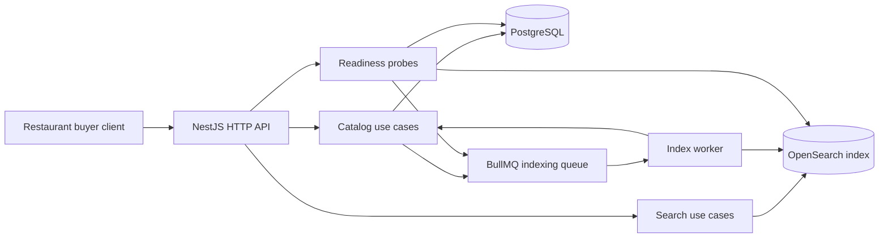

# NestJS OpenSearch Marketplace Search

Production-style NestJS backend for a food-tech marketplace search team. The service keeps PostgreSQL as the catalog source of truth, denormalizes searchable product documents into OpenSearch, and uses Redis/BullMQ to make indexing retryable and observable.

Built to demonstrate senior backend habits: explicit module boundaries, strict TypeScript, validation, API versioning, readiness probes, repeatable migrations, background jobs, OpenSearch relevance tuning, Docker-ready infra, and tests that run without local Docker.

## Architecture



## Stack

- Node.js 20+, NestJS 11, TypeScript strict mode
- PostgreSQL + Prisma migrations
- OpenSearch 3.7 index mapping with analyzers, facets, autocomplete, and scoring signals
- Redis + BullMQ for product indexing and full reindex jobs
- Swagger docs, DTO validation, rate limiting, Helmet, structured logging, request IDs
- Jest unit tests and e2e HTTP tests with infrastructure test doubles

## Quick Start

```bash
npm install
cp .env.example .env
npm run prisma:generate
npm run build
npm run test
npm run test:e2e
```

Docker is configured for a full local stack:

```bash
docker compose up -d postgres redis opensearch
npm run prisma:migrate
npm run seed
npm run search:reindex
npm run start:dev
```

Or run the app container too:

```bash
docker compose up --build
```

Swagger is served at `http://localhost:3000/docs`.

## API

```http
GET /health/live
GET /health/ready
GET /v1/products/:id
GET /v1/search/products?q=tomato&category=produce&deliveryRegion=DE-HH&inStock=true&page=1&limit=20
GET /v1/search/autocomplete?q=tom
```

Search supports:

- full-text relevance across product name, description, supplier, category, tags, and SKU
- filters for category, supplier, delivery region, stock status, and price range
- facets for categories, suppliers, and delivery regions
- sorting by relevance, price, supplier rating, and newest catalog updates
- autocomplete backed by an edge-ngram analyzer

## Search Relevance Notes

The OpenSearch query uses a `function_score` wrapper instead of raw text score alone. This lets the service blend text relevance with business signals:

- in-stock products receive a small boost
- supplier rating influences ranking without overwhelming text match
- freshness grade is indexed as a ranking signal
- exact structured filters stay in `filter` context for cacheability

The index uses an alias (`marketplace-products`) over a versioned concrete index (`marketplace-products-v1`) so a real system can introduce blue/green reindexing later without changing API code.

## Failure Modes

- Product updates enqueue BullMQ jobs with retries and exponential backoff.
- `npm run search:reindex` rebuilds the search index from PostgreSQL in cursor batches.
- `/health/ready` returns `503` when PostgreSQL, OpenSearch, or Redis queue checks fail.
- Bulk OpenSearch indexing fails fast with item-level error reporting.

## Quality Gates

```bash
npm run lint
npm run test
npm run test:e2e
npm run build
npm audit --omit=dev
```

The test suite intentionally uses mocked external infrastructure for e2e contracts so it can run on machines without Docker. Docker Compose remains available for full integration checks.
